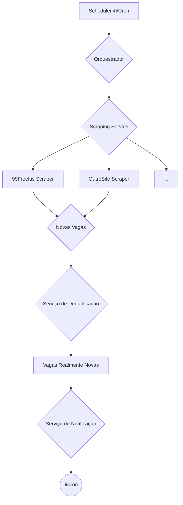

# Monitor de Vagas com NestJS

 

Um serviço de backend robusto e extensível, construído com NestJS, que monitora sites de emprego e freelancers em busca de novas oportunidades baseadas em palavras-chave e notifica em tempo real através do Discord.

## ✨ Funcionalidades

- **Monitoramento Automático**: Utiliza Cron Jobs para verificar os sites em intervalos de tempo configuráveis, garantindo que você nunca perca uma nova vaga.
- **Arquitetura Extensível**: Projetado com o padrão de estratégia (_Strategy Pattern_), permitindo adicionar novos sites para monitoramento de forma simples e limpa, sem alterar a lógica existente.
- **Notificações em Tempo Real**: Envia alertas detalhados e formatados para um canal do Discord assim que uma nova vaga compatível é encontrada.
- **Configuração Simplificada**: Gerencia chaves e URLs sensíveis de forma segura através de variáveis de ambiente (`.env`).
- **Resiliência**: Construído com tratamento de erros para lidar com falhas de rede ou mudanças na estrutura dos sites monitorados.

## 🏛️ Arquitetura

O projeto é dividido em módulos com responsabilidades claras, seguindo as melhores práticas do NestJS:

1.  **Scheduler (`TaskService`)**: O maestro do sistema. Um Cron Job que é acionado periodicamente para iniciar o processo de busca.
2.  **Scraping (`ScraperStrategy`)**: O núcleo da extração de dados. Cada site monitorado é uma implementação da `ScraperStrategy`, garantindo um contrato único para a busca de vagas.
3.  **Deduplicação de Dados**: Um serviço intermediário que garante que a mesma vaga não seja notificada múltiplas vezes. (Atualmente em memória, com plano para migração para banco de dados).
4.  **Notifications (`DiscordService`)**: O mensageiro. Responsável por formatar e enviar as informações da vaga para a plataforma de notificação configurada.



## 🛠️ Tecnologias Utilizadas

- **Framework**: [NestJS](https://nestjs.com/)
- **Linguagem**: [TypeScript](https://www.typescriptlang.org/)
- **Agendamento de Tarefas**: `@nestjs/schedule`
- **Requisições HTTP**: [Axios](https://axios-http.com/)
- **HTML Parsing**: [Cheerio](https://cheerio.js.org/)
- **Configuração**: `@nestjs/config`

## 🚀 Começando

Siga os passos abaixo para configurar e rodar o projeto em seu ambiente local.

### Pré-requisitos

- [Node.js](https://nodejs.org/en/) (v16 ou superior)
- [NPM](https://www.npmjs.com/) ou [Yarn](https://yarnpkg.com/)
- [NestJS CLI](https://docs.nestjs.com/cli/overview) (`npm i -g @nestjs/cli`)

### Instalação e Configuração

1.  **Clone o repositório:**

    ```bash
    git clone [https://github.com/seu-usuario/job-monitor.git](https://github.com/seu-usuario/job-monitor.git)
    cd job-monitor
    ```

2.  **Instale as dependências:**

    ```bash
    npm install
    ```

3.  **Configure as variáveis de ambiente:**
    - Crie uma cópia do arquivo de exemplo `.env.example` e renomeie para `.env`.
      ```bash
      cp .env.example .env
      ```
    - Abra o arquivo `.env` e adicione a URL do seu Webhook do Discord.

      ```.env
      # URL do Webhook para onde as notificações de vagas serão enviadas
      DISCORD_WEBHOOK_URL=SUA_URL_DO_WEBHOOK_AQUI
      ```

### Executando a Aplicação

- **Modo de Desenvolvimento (com hot-reload):**

  ```bash
  npm run start:dev
  ```

  O serviço iniciará e a primeira rotina de busca será executada conforme o tempo definido no Cron Job (`@Cron(CronExpression.EVERY_30_MINUTES)` por padrão).

- **Modo de Produção:**

  ```bash
  # Primeiro, compile o projeto
  npm run build

  # Depois, inicie a aplicação
  npm run start
  ```

## 🏗️ Estrutura do Projeto

```
src
├── notifications/      # Serviços de notificação (Discord, etc.)
├── scraping/           # Lógica de scraping
│   ├── implementations/  # Implementações concretas para cada site
│   └── scraper.strategy.ts # Interface que define um scraper
├── scheduler/          # O Cron Job que orquestra as tarefas
├── app.module.ts       # Módulo principal da aplicação
└── main.ts             # Arquivo de entrada da aplicação
```

## 🔌 Como Adicionar um Novo Site para Monitorar

Graças à arquitetura de estratégia, adicionar um novo site é um processo simples:

1.  **Crie a Classe do Scraper:**
    - Crie um novo arquivo em `src/scraping/implementations/`, por exemplo, `novo-site.scraper.ts`.
    - Implemente a interface `ScraperStrategy`, contendo a lógica para acessar e extrair os dados do novo site.

    ```typescript
    // src/scraping/implementations/novo-site.scraper.ts
    import { Injectable } from '@nestjs/common';
    import { Job, ScraperStrategy } from '../scraper.strategy';

    @Injectable()
    export class NovoSiteScraper implements ScraperStrategy {
      async scrape(keywords: string): Promise<Job[]> {
        // ...Sua lógica de scraping com Axios e Cheerio aqui...
        console.log(`[NovoSite] Buscando por: ${keywords}`);
        const jobs: Job[] = [];
        // ... preencha o array de jobs ...
        return jobs;
      }
    }
    ```

2.  **Registre o novo Scraper no Módulo:**
    - Abra o `app.module.ts` e adicione sua nova classe ao array de `providers`.

    ```typescript
    // src/app.module.ts
    // ...
    import { NovoSiteScraper } from './scraping/implementations/novo-site.scraper';

    @Module({
      // ...
      providers: [
        TaskService,
        DiscordService,
        NinetyNineFreelasScraper,
        NovoSiteScraper, // <-- Adicione aqui
      ],
    })
    export class AppModule {}
    ```

3.  **Use o novo Scraper no Agendador:**
    - Abra `src/scheduler/task.service.ts`, injete o novo scraper no construtor e chame seu método `scrape()` dentro do `handleCron()`.

    ```typescript
    // src/scheduler/task.service.ts
    // ...
    import { NovoSiteScraper } from 'src/scraping/implementations/novo-site.scraper';

    @Injectable()
    export class TaskService {
      // ...
      constructor(
        private readonly ninetyNineFreelasScraper: NinetyNineFreelasScraper,
        private readonly novoSiteScraper: NovoSiteScraper, // <-- Injete aqui
        private readonly discordService: DiscordService,
      ) {}

      @Cron(CronExpression.EVERY_30_MINUTES)
      async handleCron() {
        // ...
        for (const keyword of this.keywords) {
          // Chamada para o scraper antigo
          const jobs99Freelas =
            await this.ninetyNineFreelasScraper.scrape(keyword);

          // Chamada para o scraper novo
          const jobsNovoSite = await this.novoSiteScraper.scrape(keyword);

          const allJobs = [...jobs99Freelas, ...jobsNovoSite];

          for (const job of allJobs) {
            // ...lógica de notificação...
          }
        }
        // ...
      }
    }
    ```

## 📈 Roadmap (Próximos Passos)

- [ ] **Integração com Banco de Dados**: Substituir o `Set` em memória por uma solução persistente (PostgreSQL com TypeORM ou MongoDB com Mongoose) para evitar a perda de histórico de notificações.
- [ ] **API para Gerenciamento**: Criar endpoints para adicionar/remover palavras-chave e gerenciar configurações sem a necessidade de alterar o código.
- [ ] **Adicionar Scrapers Complexos**: Implementar scrapers que exijam automação de navegador (com Playwright) para sites dinâmicos (como LinkedIn).
- [ ] **Novos Canais de Notificação**: Adicionar mais serviços de notificação, como Telegram ou E-mail.

---

Distribuído sob a licença MIT. Veja `LICENSE` para mais informações.
